I model semiconductor processes.
I build the lithography tools around them.
I build the yield models that judge them.
I ship the software that runs all three.

## 01 · WORK

Research assistant at the Institute of Microstructure Technology, KIT, Korvink group.
The project is a Lenz lens for NMR signal enhancement: copper prototype first, superconducting thin film after.

Undergraduate in electrical engineering and information technology at KIT.
Everything below is open source.

## 02 · SYSTEMS

| | | |
|---|---|---|
| [`semiyield`](https://github.com/OutBlade/semiyield) | Process simulation, ML yield prediction, SPC, BSIM model-card export | `Python` |
| [`litho-agent`](https://github.com/OutBlade/litho-agent) | Process-engineering assistant with lithography, oxidation, implantation and yield tools | `Electron` `Python` |
| [`lithoforge`](https://github.com/OutBlade/lithoforge) | Lithography toolkit for MSLA printers: mask design, OPC, spacer lithography | `Python` |
| [`gds-inspector`](https://github.com/OutBlade/gds-inspector) | GDSII layout analysis for nanofabrication and electron-beam workflows | `JavaScript` |
| [`cms-hgcal-readout`](https://github.com/OutBlade/cms-hgcal-readout) | ECON-D/T frame decoder and noise characterisation for CMS HGCAL prototypes | `Python` `VHDL` |
| [`claude-code-hooks`](https://github.com/OutBlade/claude-code-hooks) | Safety hooks that stop destructive git operations and credential commits | `Shell` |

## 03 · STACK

```
PROCESS   Deal-Grove oxidation, ion implantation, plasma etch, defect-limited yield
LAYOUT    GDSII, KLayout, electron-beam lithography, OPC
CIRCUITS  SKY130 open PDK, ngspice, analog and mixed-signal
MODELS    NumPy, SciPy, XGBoost, SHAP, Bayesian process-window optimization
SOFTWARE  Python, JavaScript, C++, Electron, Streamlit, Docker, LaTeX
```



## 04 · SIGNAL

[LinkedIn](https://www.linkedin.com/in/sebastian-kallfelz-9b86913b0) &#160;·&#160;
[blade26@web.de](mailto:blade26@web.de) &#160;·&#160;
[SemiYield live demo](https://semiyield.streamlit.app)

Open to collaboration on open-source EDA, process modeling and semiconductor tooling.

<picture>
  <source media="(prefers-color-scheme: dark)" srcset="https://raw.githubusercontent.com/OutBlade/OutBlade/output/snake-dark.svg">
  <source media="(prefers-color-scheme: light)" srcset="https://raw.githubusercontent.com/OutBlade/OutBlade/output/snake.svg">
  
</picture>
