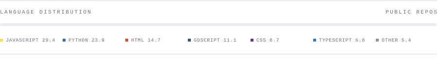

<picture>
  <source media="(prefers-color-scheme: dark)" srcset="https://raw.githubusercontent.com/OutBlade/OutBlade/main/profile/art/machine-dark.svg">
  <source media="(prefers-color-scheme: light)" srcset="https://raw.githubusercontent.com/OutBlade/OutBlade/main/profile/art/machine-light.svg">
  
</picture>

Microelectronics student at the <b>Karlsruhe Institute of Technology</b>, building open-source tools 
that put process physics, lithography and yield analytics into engineers' hands.

## 01 · Datasheet

<picture>
  <source media="(prefers-color-scheme: dark)" srcset="https://raw.githubusercontent.com/OutBlade/OutBlade/main/profile/art/datasheet-dark.svg">
  <source media="(prefers-color-scheme: light)" srcset="https://raw.githubusercontent.com/OutBlade/OutBlade/main/profile/art/datasheet-light.svg">
  
</picture>

## 02 · Process flow

From RTL to readout: every step of the flow has a tool I built for it.

<picture>
  <source media="(prefers-color-scheme: dark)" srcset="https://raw.githubusercontent.com/OutBlade/OutBlade/main/profile/art/flow-dark.svg">
  <source media="(prefers-color-scheme: light)" srcset="https://raw.githubusercontent.com/OutBlade/OutBlade/main/profile/art/flow-light.svg">
  
</picture>

| Step | Repository | What it does |
| :-- | :-- | :-- |
| <code>01&nbsp;DESIGN</code> | **[librelane-ppa](https://github.com/OutBlade/librelane-ppa)** | Timing closure and PPA exploration for LibreLane/OpenROAD: slack-driven Fmax search, config sweeps, critical-path attribution back to RTL modules. |
| <code>02&nbsp;LAYOUT</code> | **[gds-inspector](https://github.com/OutBlade/gds-inspector)** | GDS/GDSII layout viewer for browser, VS Code and Cursor: 2D/3D views, KLayout layers, hierarchy and density analysis for ASIC and EBL. |
| <code>03&nbsp;LITHO</code> | **[lithoforge](https://github.com/OutBlade/lithoforge)** | DIY lithography toolkit for MSLA printers: mask design, OPC, process calculators, spacer lithography. |
| <code>04&nbsp;PROCESS</code> | **[litho-agent](https://github.com/OutBlade/litho-agent)** | Process calculators plus a Claude-powered agent for lithography, oxidation, ion implantation and yield analysis. |
| <code>05&nbsp;YIELD</code> | **[semiyield](https://github.com/OutBlade/semiyield)** | Process simulation, ML yield prediction, SPC and Bayesian DOE in one Python toolkit. [Live demo ↗](https://semiyield.streamlit.app) |
| <code>06&nbsp;TEST</code> | **[cms-hgcal-readout](https://github.com/OutBlade/cms-hgcal-readout)** | ECON-D/T frame decoder and noise characterisation for CMS HGCAL prototype readout (lpGBT chain, VHDL firmware stubs). |

**Also on the line**

| Repository | What it does |
| :-- | :-- |
| [engineering-mcp-extensions](https://github.com/OutBlade/engineering-mcp-extensions) | MCP integrations for Ansys Lumerical, Mechanical and Fluent inside VS Code Copilot. |
| [awesome-semiconductor-industry-topics](https://github.com/OutBlade/awesome-semiconductor-industry-topics) | Curated resources with a bias toward sub-10 nm logic, lithography, process technology and advanced packaging. |
| [argus-digest](https://github.com/OutBlade/argus-digest) | Static news digest for semiconductor, AI and software topics, with a searchable archive. |
| [elastocaloric-heat-pump](https://github.com/OutBlade/elastocaloric-heat-pump) | Low-cost elastocaloric heat pump research with polymer films: thermal/mechanical behaviour and a small cooling demonstrator. |

## 03 · Layer stack

What I work on, top metal to substrate.

| Layer | Focus | Details |
| :-- | :-- | :-- |
|  | **Applied ML** | Yield prediction · statistical process control · Bayesian DOE |
|  | **Analog IC design** | SkyWater SKY130 open PDK · ngspice · LibreLane / OpenROAD |
|  | **Lithography** | Resolution & DoF · OPC · GDSII · e-beam lithography |
|  | **Process modeling** | Deal–Grove oxidation · ion implantation · plasma etch |
|  | **Device physics** | Superconducting Lenz-lens resonators for NMR signal enhancement (IMT, KIT) |

## 04 · Toolchain

| | |
| :-- | :-- |
| **Simulation** |    |
| **Layout & PnR** |     |
| **Hardware** |    |
| **Analysis** |     |
| **Software** |  |

## 05 · Activity

## 06 · Wafer map

<picture>
  <source media="(prefers-color-scheme: dark)" srcset="https://raw.githubusercontent.com/OutBlade/OutBlade/main/profile/art/wafer-dark.svg">
  <source media="(prefers-color-scheme: light)" srcset="https://raw.githubusercontent.com/OutBlade/OutBlade/main/profile/art/wafer-light.svg">
  
</picture>

<b>Bins 2–6: developer tools, games, math, web and forks</b>

#### Bin 2 · Developer tools

| Project | What it does |
| --- | --- |
| [claude-code-hooks](https://github.com/OutBlade/claude-code-hooks) | Safety hooks for Claude Code. Stops rm -rf, force-push to main, and API key commits before they happen. |
| [electron-win-template](https://github.com/OutBlade/electron-win-template) | Electron starter template for Windows apps with NSIS installers, GitHub Releases, and automatic updates. |
| [hackxplore-template](https://github.com/OutBlade/hackxplore-template) | HackXplore 2026 Starter Template: FastAPI + Streamlit + OpenCV + Anthropic |
| [kit-campus-mcp](https://github.com/OutBlade/kit-campus-mcp) | MCP server for the KIT Campus portal: exam results, registrations, study progress, timetables, and module catalogues. |
| [memecoin-freqtrade-bot](https://github.com/OutBlade/memecoin-freqtrade-bot) | Virtual paper-trading bot for memecoins on Freqtrade with real fees. |
| [mineblade](https://github.com/OutBlade/mineblade) | Free one-click Minecraft server hosting on your own machine. |
| [obsidian-vault-dashboard](https://github.com/OutBlade/obsidian-vault-dashboard) | Interactive Obsidian plugin: live vault stats, force-directed knowledge graph, tag cloud, and recently modified notes. |
| [pgspy](https://github.com/OutBlade/pgspy) | Transparent PostgreSQL proxy with a live query dashboard, query timing, and N+1 detection for application development. |
| [study-tutor](https://github.com/OutBlade/study-tutor) | Claude AI exam tutor as an Electron desktop app: per-module chats, PDF lecture upload with prompt caching, LaTeX rendering, exam question generator. |
| [youtube-playlist-downloader](https://github.com/OutBlade/youtube-playlist-downloader) | YouTube playlist downloader: MP3 with cover art, 1080p video and ZIP64 archives. C++17 backend, browser UI, Docker self-hosting. |

#### Bin 3 · Games

| Project | What it does |
| --- | --- |
| [aggressor-chess-web](https://github.com/OutBlade/aggressor-chess-web) | Browser chess game with a JavaScript AI engine, minimax search, alpha-beta pruning, and adjustable difficulty. |
| [balatro-web](https://github.com/OutBlade/balatro-web) | Play the Balatro GBA fan demake instantly in your browser, on PC and mobile. |
| [call-center-tycoon](https://github.com/OutBlade/call-center-tycoon) | Satirical tycoon simulation game for Windows, built with Electron. |
| [neon-harbor](https://github.com/OutBlade/neon-harbor) | Open world neon city action game. Procedural city, car chases, five star wanted system. Godot 4.6, zero binary assets. |
| [neon-pulse](https://github.com/OutBlade/neon-pulse) | A precision-dash roguelike in a neon-drenched void. Electron desktop app with procedural audio and achievements. |
| [sudoku-online-download](https://github.com/OutBlade/sudoku-online-download) | Download page for the Sudoku Online Android app, with an APK, version metadata, and privacy information. |
| [SudukoOnline](https://github.com/OutBlade/SudukoOnline) | Multiplayer Sudoku, TicTacToe, and board game platform for Android: Firebase real-time sync, league system, AI opponents. |
| [tichu-stats](https://github.com/OutBlade/tichu-stats) | Interactive Tichu statistics reference: bomb probabilities, Grand Tichu decisions, passing strategies, and source-linked tables. |

#### Bin 4 · Math & learning

| Project | What it does |
| --- | --- |
| [dtZahlensysteme](https://github.com/OutBlade/dtZahlensysteme) | Number system converter and learning portal (DE/EN): decimal, binary, octal, hex with step-by-step explanations. |
| [erdos-notes](https://github.com/OutBlade/erdos-notes) | Reproducible notes on Erdos problems 617, 835, 1221, and 550: partial results, statement corrections, and Lean proof audits. |
| [mandelbrot-visualizer](https://github.com/OutBlade/mandelbrot-visualizer) | Interactive Mandelbrot set explorer for Windows: smooth zoom to 1000x+, zoom video recording, color schemes. |
| [mathgpt-clone](https://github.com/OutBlade/mathgpt-clone) | Full-stack AI math solver: text/LaTeX/image input and step-by-step solutions. |

#### Bin 5 · Web & community

| Project | What it does |
| --- | --- |
| [sudoku-online-privacy](https://github.com/OutBlade/sudoku-online-privacy) | German and English privacy-policy pages for the Sudoku Online Android app. |
| [HACK-OPS-KA/Website](https://github.com/HACK-OPS-KA/Website) | hack//ops community website for Karlsruhe: events, project archive, and a Firebase-backed event voting system. |
| [hackops-ka/hackops-site](https://github.com/hackops-ka/hackops-site) | hack//ops landing-page source for the Karlsruhe builder community. |

#### Bin 6 · Forks & event archives

| Project | What it does |
| --- | --- |
| [balatro-gba](https://github.com/OutBlade/balatro-gba) | Fork of the Balatro Game Boy Advance fan demake. |
| [erdosproblems](https://github.com/OutBlade/erdosproblems) | Contribution fork of the community Erdos problems database. |
| [SLOPATHON](https://github.com/OutBlade/SLOPATHON) | Contribution fork of the HACK//OPS SLOPATHON OP001 project archive in Karlsruhe. |
| [winget-pkgs](https://github.com/OutBlade/winget-pkgs) | Contribution fork of the Windows Package Manager community repository. |
| [HACK-OPS-KA/SLOPATHON](https://github.com/HACK-OPS-KA/SLOPATHON) | Project archive for HACK//OPS SLOPATHON OP001 in Karlsruhe. |

Open to collaboration on open-source EDA, process modeling and semiconductor tooling. Artwork is generated by <a href="profile/art/build.py">profile/art/build.py</a>.

